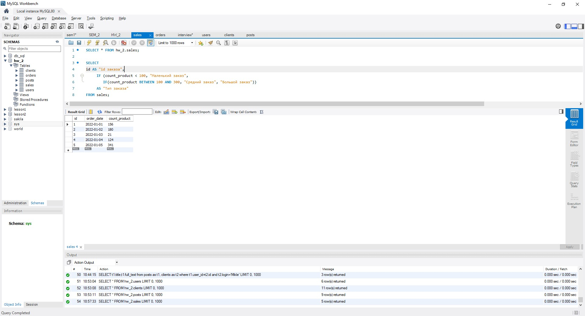
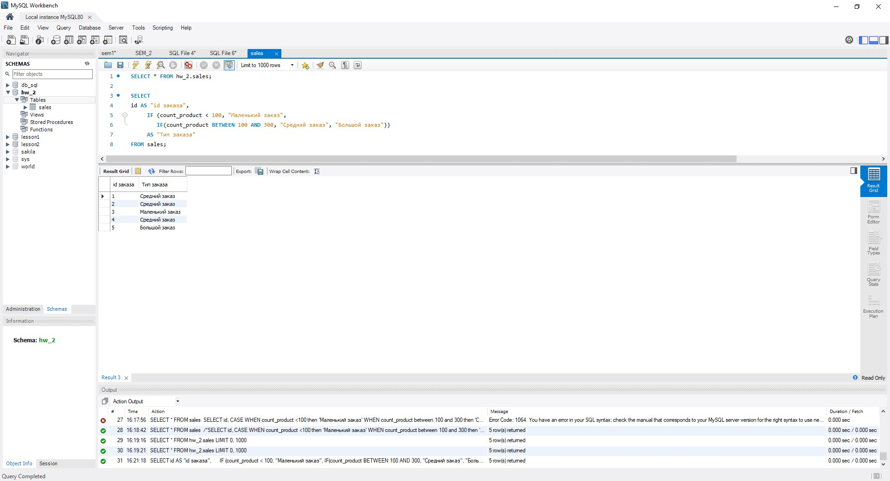
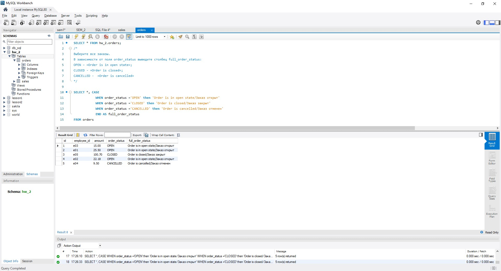
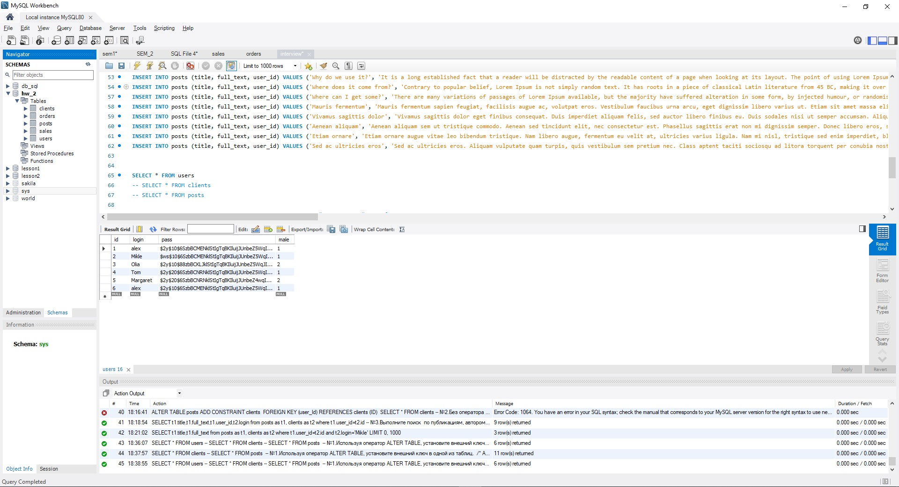
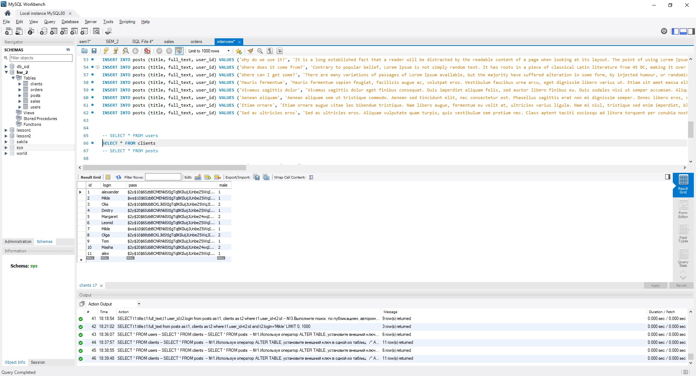
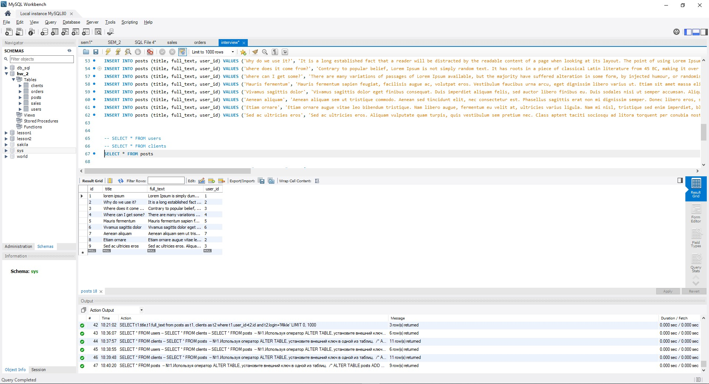
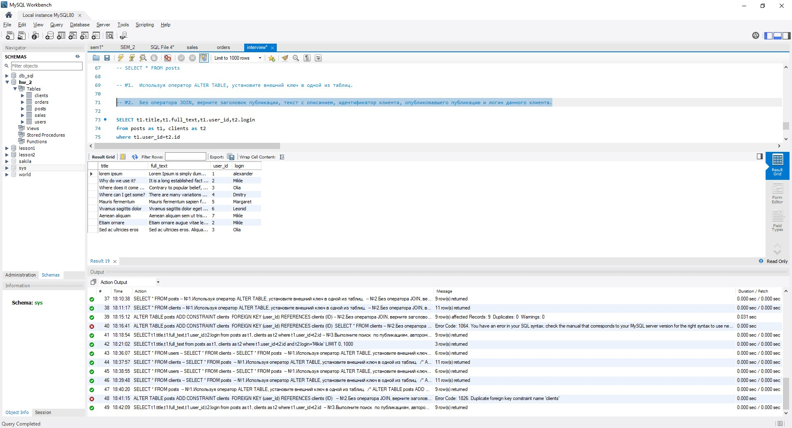
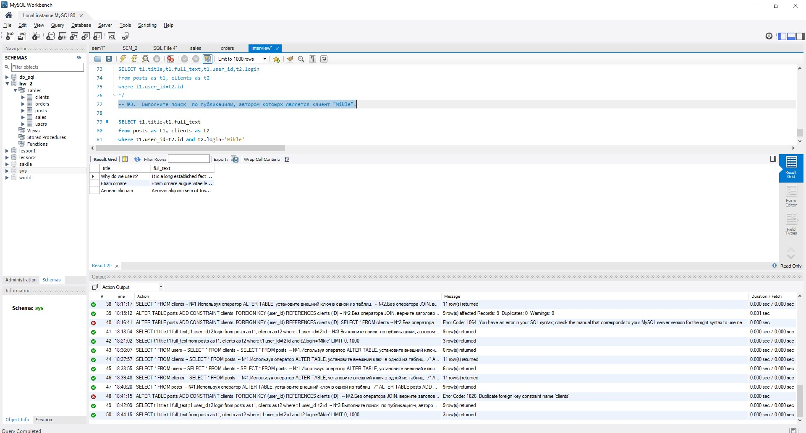

## Базы данных и SQL (семинары)
## Урок 2. SQL – создание объектов, простые запросы выборки

### Задание:
   1) Используя операторы языка SQL, создайте табличку “sales”. Заполните ее данными

   2) Сгруппируйте значений количества в 3 сегмента — меньше 100, 100-300 и больше 300.

   3) Создайте таблицу “orders”, заполните ее значениями. Покажите “полный” статус заказа, используя оператор CASE

### Дополнительное задание.  
Файл со скриптом прикреплен к материалам(interview.sql):

Таблица users:

Таблица clients:

Таблица posts:

№1. Используя оператор ALTER TABLE, установите внешний ключ в одной из таблиц.  
№2. Без оператора JOIN, верните заголовок публикации, текст с описанием, идентификатор клиента,  
опубликовавшего публикацию и логин данного клиента.   
 
№3. Выполните поиск по публикациям, автором котоырх является клиент "Mikle".

