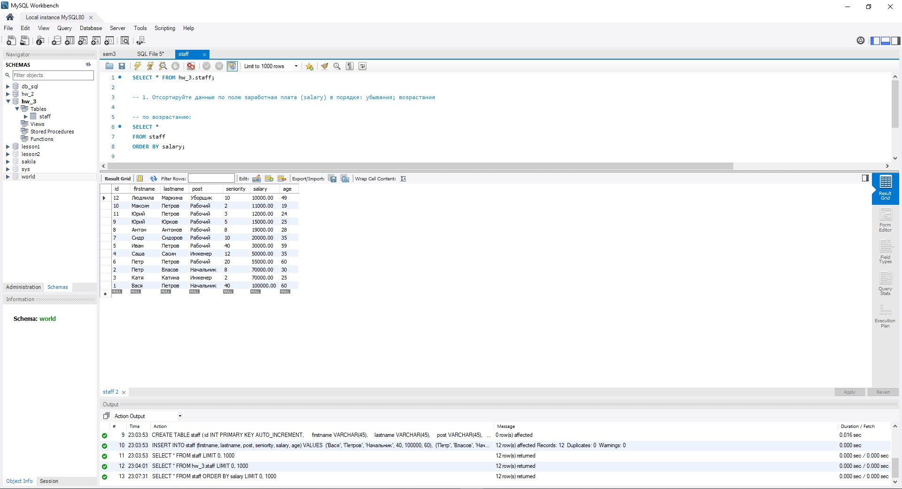
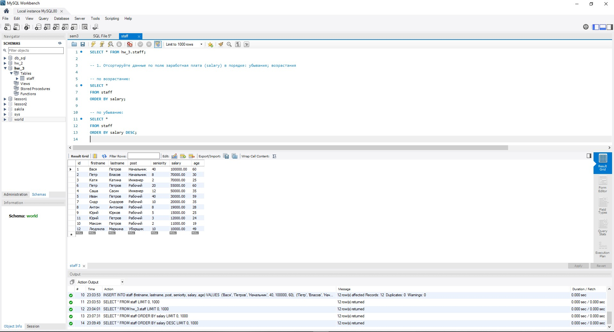
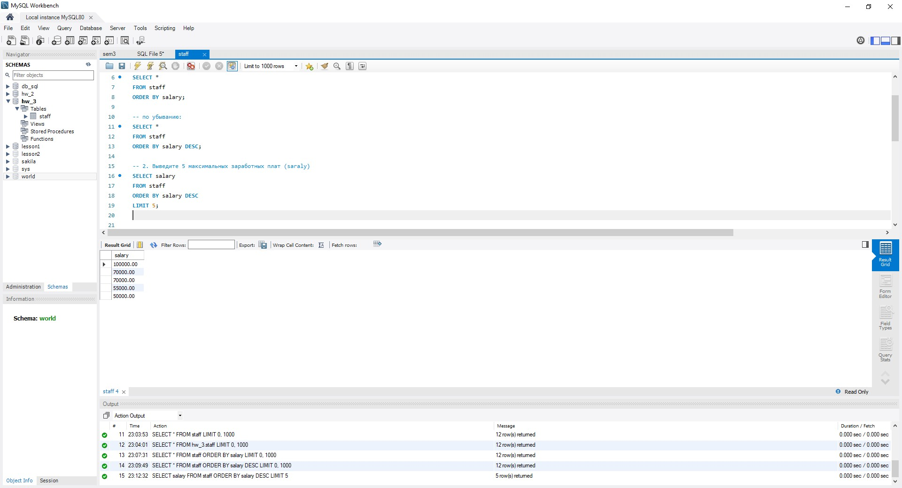
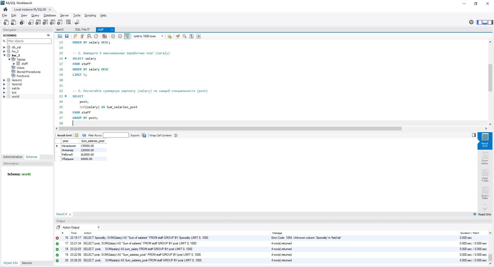
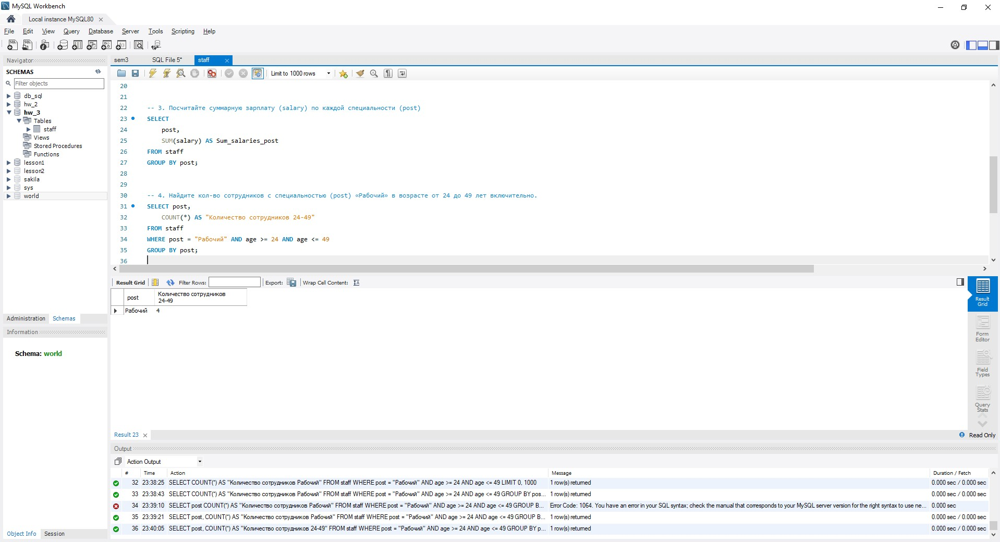
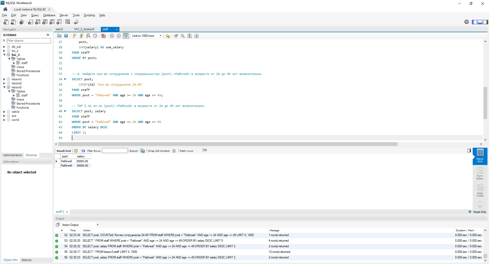
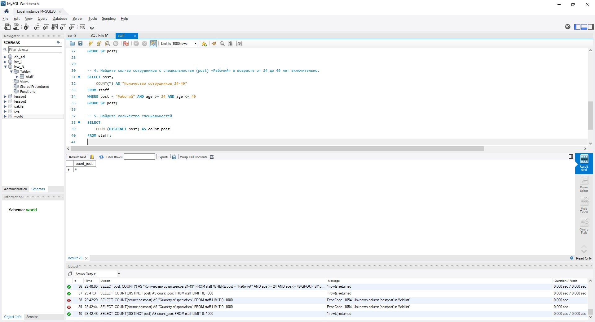
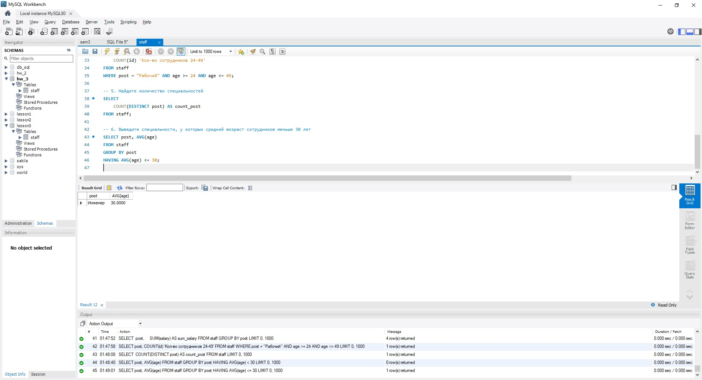

## Базы данных и SQL (семинары).
## Урок 3. SQL – выборка данных, сортировка, агрегатные функции.

Таблица для работы на слайде.  
1) Отсортируйте данные по полю заработная плата (salary) в порядке: убывания; возрастания.  
- По возростанию ЗП.  
  
- По убыванию ЗП.  
  
2) Выведите 5 максимальных заработных плат (saraly).  
  
3) Посчитайте суммарную зарплату (salary) по каждой специальности (роst).  
  
4) Найдите кол-во сотрудников с специальностью (post) «Рабочий» в возрасте от 24 до 49 лет включительно.  
  
- TOP 2 по зп по (post) «Рабочий» в возрасте от 24 до 49 лет включительно.  

5) Найдите количество специальностей.  
  
6) Выведите специальности, у которых средний возраст сотрудников меньше 30 лет включительно.  
7) 