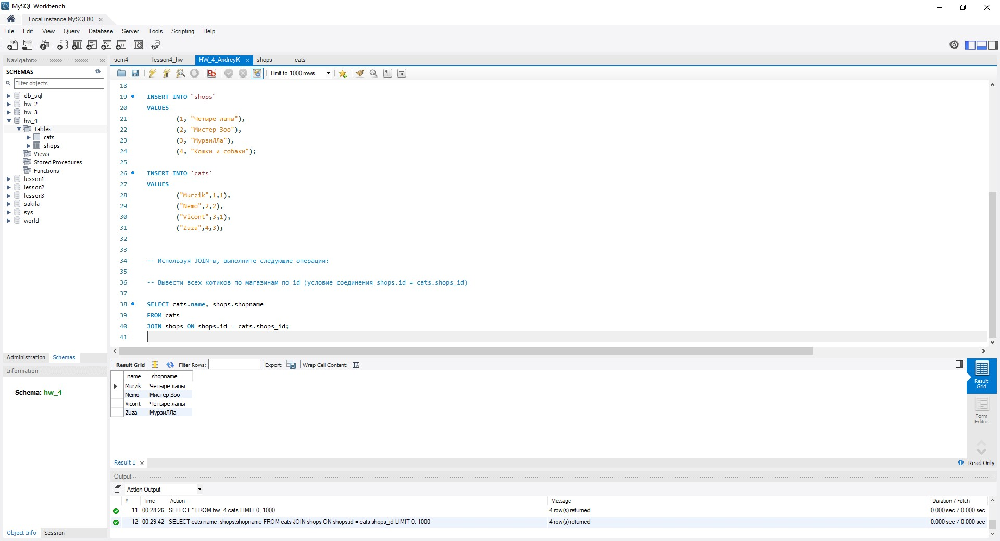
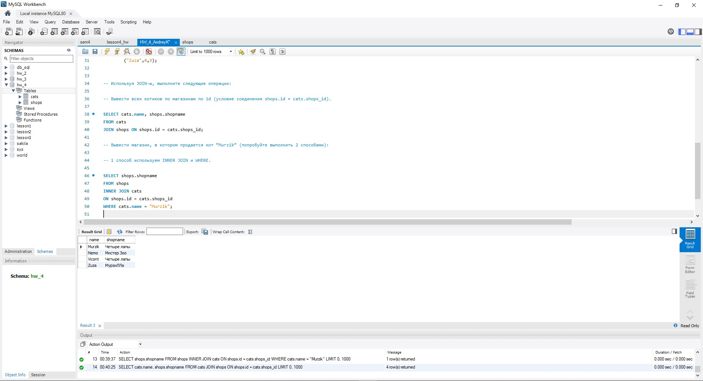
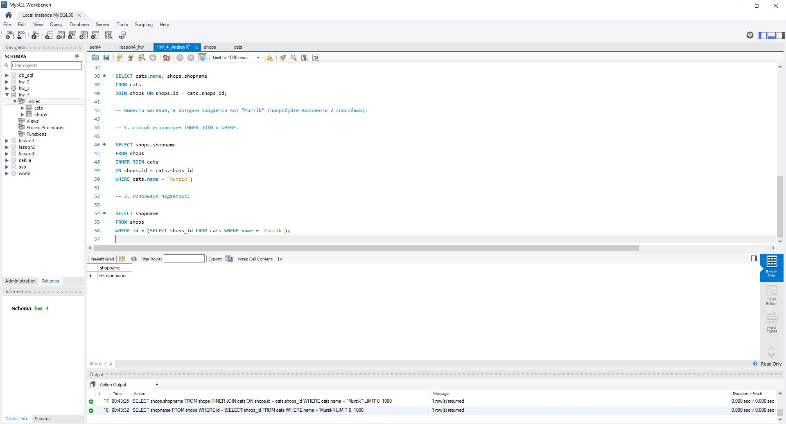
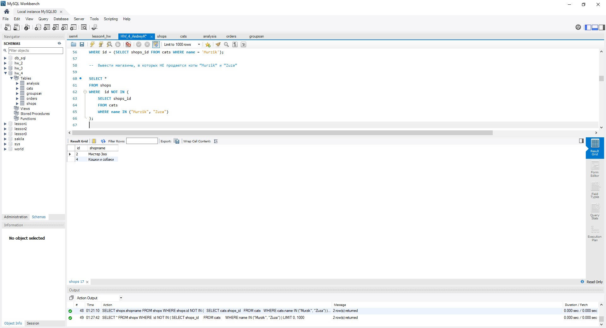
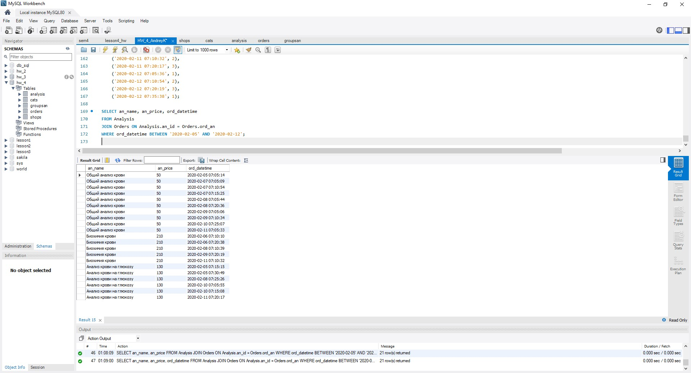
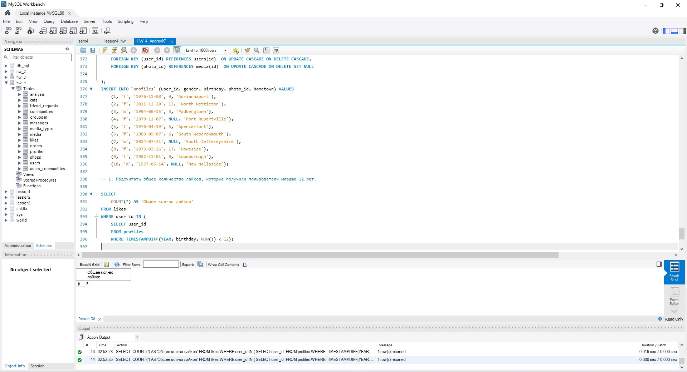
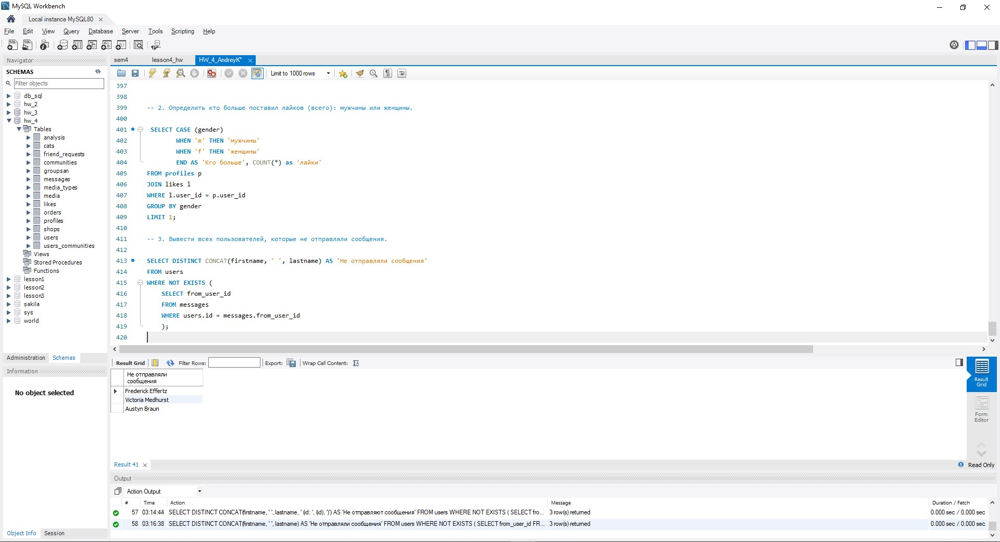
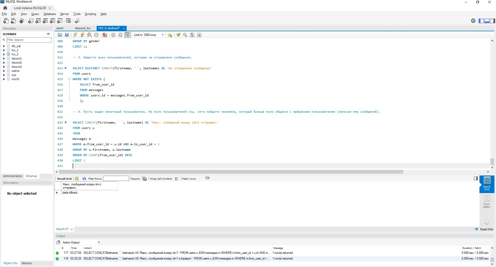

## Базы данных и SQL (семинары).
## Урок 4. SQL – работа с несколькими таблицами.  

### Основное ДЗ:  
  
### Задача 1.  
Табличка: https://drive.google.com/file/d/1TZzW8ZlDdvIfDC9C46bUeILey6opQjdu/view?usp=share_link.  
Используя JOIN-ы, выполните следующие операции:  
- Вывести всех котиков по магазинам по id (условие соединения shops.id = cats.shops_id),  
 
- Вывести магазин, в котором продается кот “Мурзик” (попробуйте выполнить 2 способами),  
Способ 1. Используем INNER JOIN и WHERE.  
  
Способ 2. Используем подзапрос.  

- Вывести магазины, в которых НЕ продаются коты “Мурзик” и “Zuza”.  

### Задача 2.  
Табличка (после слов “Последнее задание, таблица:”):  
https://drive.google.com/file/d/1TZzW8ZlDdvIfDC9C46bUeILey6opQjdu/view?usp=share_link.  
- Вывести название и цену для всех анализов, которые продавались 5 февраля 2020 и всю следующую неделю.  

### Дополнительное ДЗ:

1. Подсчитать общее количество лайков, которые получили пользователи младше 12 лет.  
  
2. Определить кто больше поставил лайков (всего): мужчины или женщины.  

3. Вывести всех пользователей, которые не отправляли сообщения.  

4( по желанию)* Пусть задан некоторый пользователь. Из всех друзей этого пользователя найдите человека,  
    который больше всех написал ему сообщений.  
