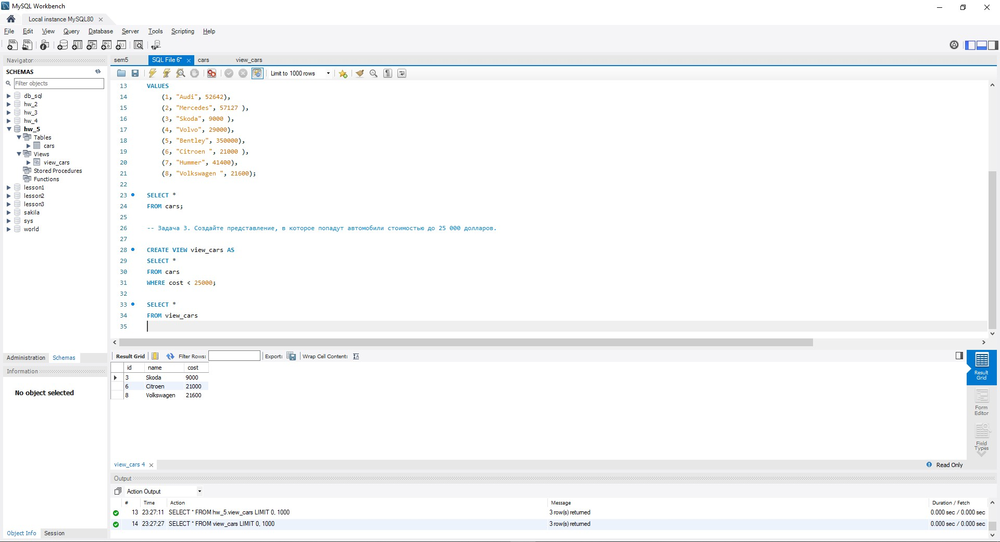
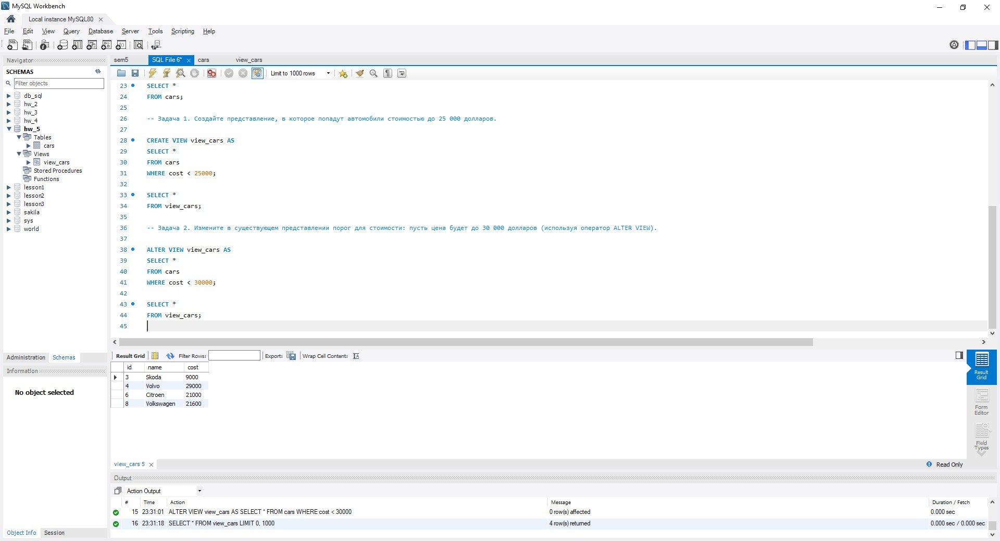
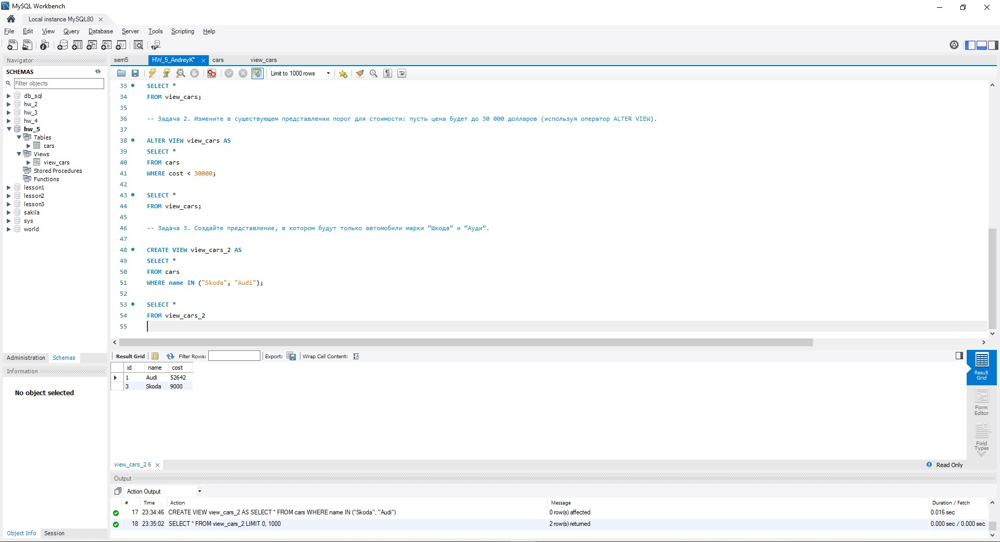

## Базы данных и SQL (семинары).
## Урок 5. SQL – оконные функции.  

### Основное ДЗ:  
  
Файл:  
https://docs.google.com/spreadsheets/d/1bKCfz2tMENAISBxU7XRevge1qraNuPoN/edit?usp=share_link&ouid=112631188905352530754&rtpof=true&sd=true  
Скрипт:  
https://drive.google.com/file/d/1rkNr6GHSE9ulRs39BB4RC80aKMg1c7Jw/view?usp=share_link  
  
### Задача 1.	Создайте представление, в которое попадут автомобили стоимостью  до 25 000 долларов.  
  
### Задача 2.	Изменить в существующем представлении порог для стоимости: пусть цена будет до 30 000 долларов  (используя оператор ALTER VIEW).  
  
### Задача 3. 	Создайте представление, в котором будут только автомобили марки “Шкода” и “Ауди”.  

